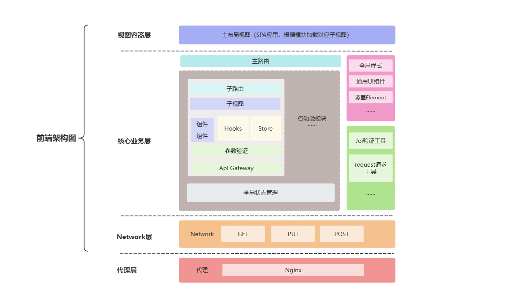

<script setup>
import archTable from './components/archTable.vue';

</script>
# 工程架构设计
## 架构演进三阶段
<archTable />

## 项目结构展示
web端项目结构大致分为三个部分：
- libs：存放公共的库，如api、router、store等
```
  libs
    ├── api     # 通用request请求工具
    ├── router  # 主路由管理
    ├── store   # 全局状态管理
    └── utils   # 通用工具库
 ```
- features：存放功能模块，如cm、dd、fu等
```
features
├── cm
│   ├── api         # 模块api（依赖于通用request请求工具）
│   ├── components  # 功能模块组件
│   ├── hooks       # 模块内可复用hooks
│   ├── index.vue   # 模块子视图
│   ├── router.ts   # 模块路由管理
│   ├── store       # 模块内状态管理（可用于组件间通信）
│   ├── styles.scss
│   └── types       # 模块内类型定义
├── dd
└── fu

```
- shared：存放共享组件，如assets、components、layout等
```
shared
├── assets
│   ├── font
│   ├── icons
│   ├── logo
│   ├── styles
├── components
│   ├── business    # 业务组件
│   └── common      # 通用组件
└── layout          # 布局组件
    └── index.vue

```
同时在完整项目上采用了`monorepo`架构模式，将所有的项目都放在一个仓库中，这样可以方便管理和维护。

项目目录大致如下：
```
ophai_diag_frontend
├── Dockerfile
├── apps                # 应用层，存放各个应用的代码
├── core                # 核心层，存放公共的配置
├── default.conf
├── eslint.config.js
├── node_modules
├── package.json
├── packages            # 包管理层，存放各个本地依赖包（通用工具库，品牌UI组件库）
└── pnpm-workspace.yaml

```

## 系统架构设计

### 视图容器层
- **主布局视图：** 作为单页应用（SPA）的基础框架，根据模块需求动态加载对应的子视图，构成用户最终看到的界面结构。
### 核心业务层
- **路由系统：**
  + **主路由：** 掌控整体导航流程，协调不同模块的路由配置。
  + **子路由：** 进一步细分页面路径，精准定位到具体的子视图（各个页面）。
- **业务逻辑单元：**
  + **组件：** 页面构成的基本单元，具备复用性。
  + **Hooks：** 封装可复用的逻辑，提升代码灵活性与复用性。
  + **Store：** 集中管理应用状态，确保多组件间数据的统一与共享。
  + **参数验证：** 使用封装后`Joi-validate` 工具，对输入数据进行模块特性合法性校验。
  + **API Gateway：** 统一管理API请求，封装请求逻辑，简化开发流程。
- **事件中心：** 通过**事件中心**实现组件间的事件通信，解耦复杂的业务逻辑。
- **辅助功能模块：**
  + 右侧独立区域包含**全局样式**（统一应用整体风格）、**通用 UI 组件**（提升开发效率，减少重复开发）、**覆盖 Element 样式**（对第三方组件进行定制）等。
  + **Joi 验证工具、request 请求工具**等，为数据验证与网络请求提供支持，确保数据交互的准确性与稳定性。
### Network 层
- 专注于网络通信，使用**GET、PUT、POST**等常见的 HTTP 请求方法，是前端与后端服务器进行数据交互的桥梁，负责数据的发送与接收。
### 代理层
- 采用`Nginx`作为代理服务器，主要承担请求转发、缓存处理等任务，优化网络请求性能，同时增强应用的安全性与稳定性，例如处理跨域请求、负载均衡等。