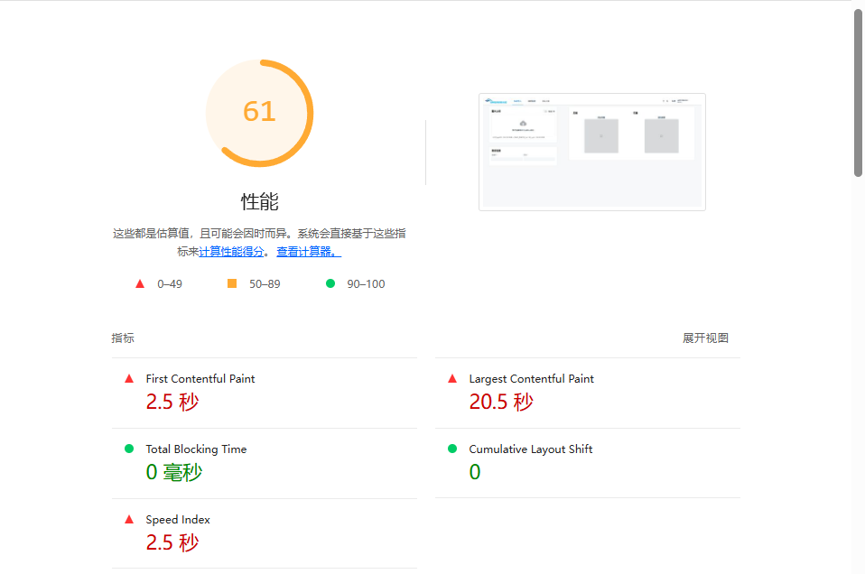

# 性能优化方案
我们引入`lighthouse`进行性能测试，这里先看实验室结论：

**优化前：**


**优化后：**

我们可以对比看出，FCP缩短了**约80%**，LCP缩短了**约97%**，性能提升明显。不过这些数据只是实验室数据，实际应用中还需要考虑更多的因素。

## 性能监控体系
监控`首次绘制时间(FP)`、`首次内容绘制时间(FCP)`等核心指标
- FP（First Paint）反映浏览器首次将任何内容渲染到屏幕的时间，是白屏时间的重要参考
- FCP（First Contentful Paint）标记首次文本/图像内容渲染完成时间。
```typescript
export const initPerformanceMonitor = () => {
  const perf = window.performance;
  
  // 关键时间节点记录
  perf.mark('vue-app-start');

  return {
    getFirstPaintTime: () => {
      const [paintEntry] = perf.getEntriesByType('paint');
      return paintEntry?.startTime || 0;
    },
    getFirstContentfulPaint: () => {
      const [navigationEntry] = perf.getEntriesByType('navigation') as PerformanceNavigationTiming[];
      const fcp = perf.getEntriesByName('first-contentful-paint')[0]?.startTime || 0;
      return navigationEntry ? fcp - navigationEntry.startTime : 0;
    },
    
    // ······
    
    sendMetrics: (metrics: object) => {
      //发送到监控平台
      sendToMonitor(metrics);
    }
  };
};
```
## 代码构建优化
- 使用`Vite`的`rollupOptions`配置，将`Element Plus`、`Vue`、`Vue Router`、`Pinia`等框架进行**按需加载**，减少首屏加载体积。
- 开启`gzip`压缩，减少传输体积。
```typescript
// vite.config.ts
export default defineConfig({
  build: {
    rollupOptions: {
      output: {
        manualChunks: {
          "element-plus": ["element-plus"],
          "vue-bundle": ["vue", "vue-router", "pinia"],
          "echarts": ["echarts","vue-echarts"],
        }
      }
    }
  }
})
```

## 路由优化
使用`Vue Router`的`懒加载`特性，同时基于基于`Vite`的动态import实现代码分割，**按需加载**路由组件，首屏体积减少**约40%**。
```typescript
// 模块内子路由
import type { RouteRecordRaw } from 'vue-router'
export const ddRoutes: RouteRecordRaw[] = [
  {
    path: '/dd/:id?',
    name: 'DiseaseDiagnosis',
    component: () => import('./index.vue'),
    props: true,
  }
]
```

```javascript
// 主路由
import { createRouter, createWebHistory, RouteRecordRaw } from 'vue-router'
import {fuRoutes} from '@/features/fu/router.ts'
import {cmRoutes} from '@/features/cm/router.ts'
import {ddRoutes} from '@/features/dd/router.ts'
const routes: RouteRecordRaw[] = [
  {
    path: '/',
    component: () => import('@/shared/layout/index.vue'),
    children: [
      ...fuRoutes,
      ...cmRoutes,
      ...ddRoutes,
    ]
  },
]
const router = createRouter({
  history: createWebHistory(import.meta.env.BASE_URL),
  routes,
})
export default router
```
## 图片加载优化
实现图片预览的**懒加载策略、错误边界处理与提示**。
```vue
<el-image
    class="grid-item__image"
    fit="contain"
    :src="patient.previewLeft"
    :lazy="true"
    :preview-teleported="true"
    :preview-src-list="[patient.previewLeft, patient.previewRight]">
    <template #error>
      <div class="grid-item__error">左眼图片未上传</div>
    </template>
</el-image>
```
## 样式优化
- 通过Sass颜色函数生成色阶，实现主题系统化
- 样式复用率达90%+，减少重复代码
```scss
@use "sass:map";
@use "sass:math";
@use "sass:color";

// 定义品牌主题颜色系统
$colors: (
        primary: #3ea2e4,
        success: #43cd88,
        info:    #bebebe,
        warning: #ffb15f,
        danger:  #f74047
);
$MaxStep: 9;
// 生成浅色和深色变体
@each $key, $value in $colors {
  @for $i from 1 through $MaxStep {
    $light: color.mix(#fff, $value, (math.div($i, $MaxStep + 1)) * 100%);
    $colors: map.merge($colors, (#{$key}-light-#{$i}: $light));

    $dark: color.mix(#000, $value, (math.div($i, $MaxStep + 1)) * 100%);
    $colors: map.merge($colors, (#{$key}-dark-#{$i}: $dark));
  }
}
```
