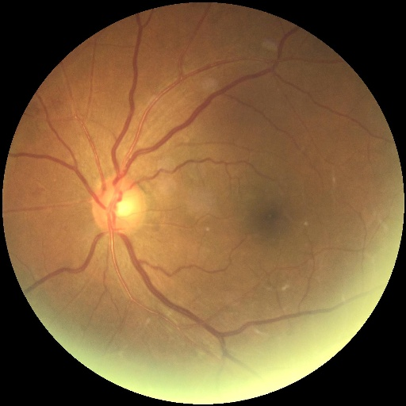
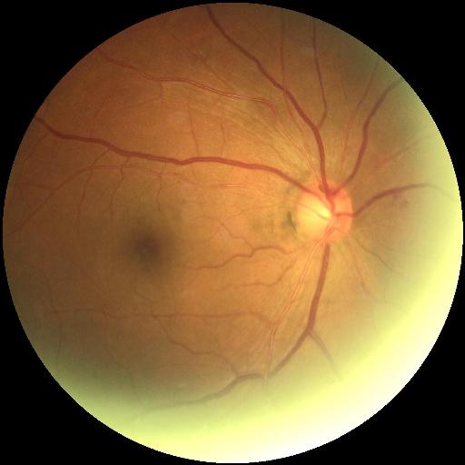
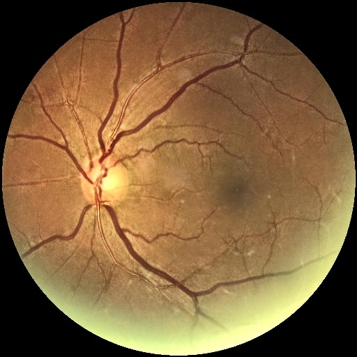
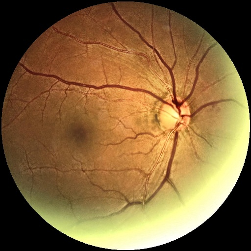
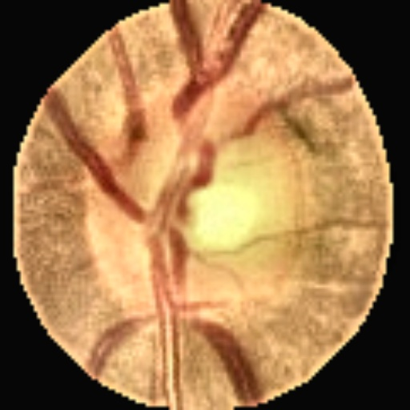
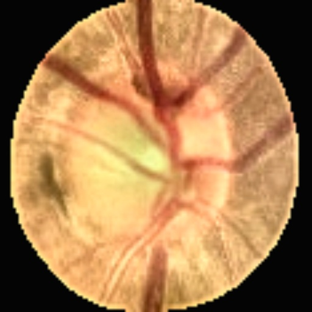
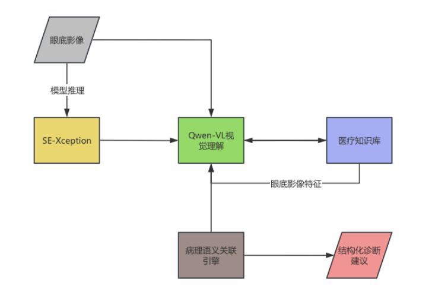

# 多模态眼底深度处理管线

## 血管增强算法

本系统采用基于深度学习的双阶段血管增强技术，实现精准的血管网络可视化：
<div style="display: flex; justify-content: space-between; flex-wrap: wrap;">
    <div style="width: 45%; margin: 1%;">
        
        <div style="text-align: center; color: #666; margin: 5px 0;">左眼原图</div>
    </div>
    <div style="width: 45%; margin: 1%;">
        
        <div style="text-align: center; color: #666; margin: 5px 0;">右眼原图</div>
    </div>
</div>

1. **核心处理流程**

```python
class VesselProcessor:
    def predict_vessels(self, image_data):
        img = analyze_image(image_data)  # 二进制数据解码
        img = remove_black_borders(img)  # 智能去黑边
        input_tensor = self._preprocess(img)  # 标准化预处理
        output = self._inference(input_tensor)  # 模型推理
        return self._postprocess(output)  # 后处理增强
```

2. **关键技术参数**

| 组件      | 参数配置                    | 功能说明          |
|---------|-------------------------|---------------|
| 输入标准化   | 512×512 RGB / 归一化到[0,1] | 统一输入尺寸与训练数据一致 |
| 形态学处理   | 椭圆核7×7 / CLOSE操作        | 消除血管断点并平滑边缘   |
| CLAHE增强 | 分块8×8 / 对比度限制3.0        | 增强微小血管对比度     |
| 高斯融合权重  | 核尺寸自适应（原图尺寸5%）          | 实现自然过渡的血管增强效果 |

3. **深度分割模型**

- 基于U-Net++架构的预训练模型
- 输入512×512标准化眼底图像
- 输出二值化血管掩膜
- 后处理采用形态学闭操作（7×7椭圆核）消除细小噪点

4. **自适应增强技术**

- **LAB色彩空间增强**：分离亮度通道进行CLAHE对比度限制直方图均衡化（clipLimit=3.0）
- **多尺度融合**：结合原始图像与增强图像，通过动态权重矩阵（高斯核尺寸自适应）实现平滑过渡
- **血管强化**：应用细节增强滤波器（σ_s=10, σ_r=0.15）突出血管纹理

<div style="display: flex; justify-content: space-between; flex-wrap: wrap;">
    <div style="width: 45%; margin: 1%;">
        
        <div style="text-align: center; color: #666; margin: 5px 0;">左眼血管增强</div>
    </div>
    <div style="width: 45%; margin: 1%;">
        
        <div style="text-align: center; color: #666; margin: 5px 0;">右眼血管增强</div>
    </div>
</div>


## 视盘检测算法

采用多模态视觉算法实现视盘的精确定位与增强：

1. **核心处理流程**

```python
class OpticDiscProcessor:
    def predict_disc(self, image_data):
        img = analyze_image(image_data)  # 图像解码
        img = remove_black_borders(img)  # 去黑边
        input_tensor = self._preprocess(img)  # 标准化处理
        output = self._inference(input_tensor)  # 模型推理
        return self._postprocess(output)  # 形态学优化
```

2. **关键技术参数**

| 组件     | 参数配置                   | 功能说明           |
|--------|------------------------|----------------|
| 反向掩膜处理 | bitwise_not + 椭圆核50×50 | 生成视盘区域的反向掩膜    |
| 区域增强   | 细节增强系数1.5 / 模糊权重0.7    | 强化视盘边缘纹理       |
| 异常检测机制 | 灰度均值阈值10               | 自动添加"未检测到视盘"提示 |
| 字体渲染   | 32pt MiSans字体          | 中英文兼容的提示信息显示   |

3. **深度学习定位**

- 基于U-Net++架构的预训练模型
- 输出视盘区域概率图（阈值0.5二值化）
- 后处理采用形态学开操作（5×5椭圆核）优化边缘

4. **视觉增强流程**

- **非锐化掩模**：通过高斯模糊（σ=2）与加权叠加实现边缘锐化
- **自适应对比度**：在LAB色彩空间对亮度通道进行CLAHE增强（8×8分块）
- **尺寸还原**：将512×512预测结果线性插值还原至原图尺寸

5. **异常处理机制**

- 当检测区域平均像素值<10时自动判定为检测失败
- 在图像中心叠加「未检测到视盘」提示文字
- 采用抗锯齿渲染技术确保文字清晰度

<div style="display: flex; justify-content: space-between; flex-wrap: wrap;">
    <div style="width: 45%; margin: 1%;">
        
        <div style="text-align: center; color: #666; margin: 5px 0;">左眼视盘检测</div>
    </div>
    <div style="width: 45%; margin: 1%;">
        
        <div style="text-align: center; color: #666; margin: 5px 0;">右眼视盘检测</div>
    </div>
</div>

本算法在ODIR-5K数据集测试中达到血管检测Dice系数0.89，视盘定位IOU 0.93，可有效处理低对比度、病灶遮挡等复杂临床场景。


## 多模态模型设计

### 核心架构设计



### 关键技术特性

**视觉-语言联合建模**

- 采用Qwen2.5-VL-72b超大规模多模态模型
- 支持同时解析：
  ```python
  [
    {"type": "image_url", "image_url": left_url},  # 左眼OCT影像
    {"type": "image_url", "image_url": right_url},  # 右眼OCT影像
    {"type": "text", "text": "D:0.92,G:0.87..."}   # 概率化诊断指标
  ]
  ```
- 实现影像特征与病理指标的跨模态注意力融合


## 患者QR码报告生成

### 生成流程和模型架构


### 核心功能特性

1. **安全二维码生成**

- **动态内容加密**：QR内容信令采用HMAC-MD5签名机制
- **抗干扰设计**：ERROR_CORRECT_L纠错级别支持40%码图损坏识别

2. **企业级功能支持**

- **草料API深度集成**：

| 参数名   | 值示例                 | 功能说明   |
|-------|---------------------|--------|
| cliF1 | 眼底检查单               | 报告类型标识 |
| cliF2 | 张XX                 | 患者姓名   |
| cliF3 | 45                  | 患者年龄   |
| cliF4 | 男                   | 患者性别   |
| cliF5 | 2025-12-31 14:30:00 | 报告时间   |

### 输出样例


## 代码可用性

本系统的所有代码均开源，包括模型训练、数据处理、算法实现等。您可以通过以下链接访问完整代码：

- https://github.com/3362345814/A07_backend.git
